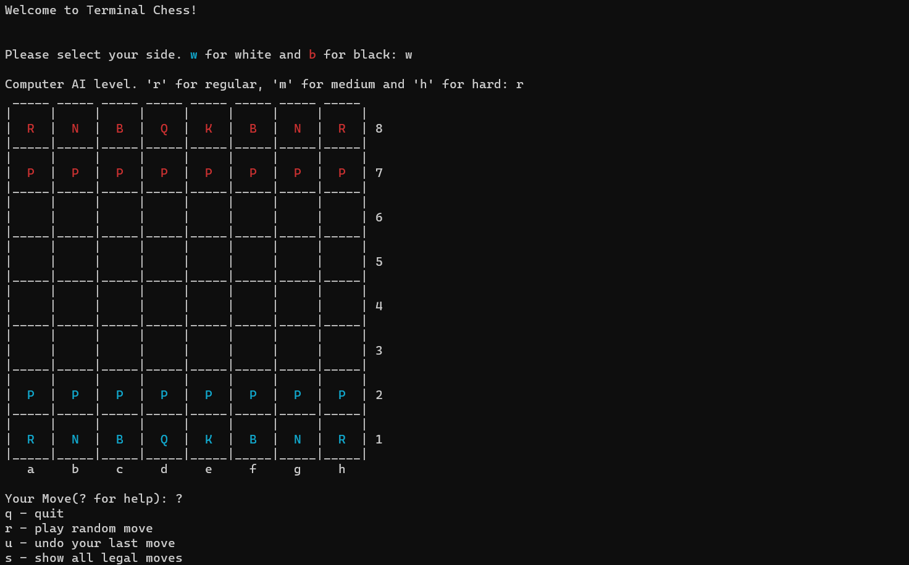

# terminal-chess
Python program to play chess from your terminal. Requires Python 3. Work In Progress.

## Demo

## Todo
- [x] Basic project structure and event flow.
- [x] Rook functionality.
- [x] Implement logic for Pawn, Knight, Bishop, King and Queen.
- [ ] Implement computer AI.